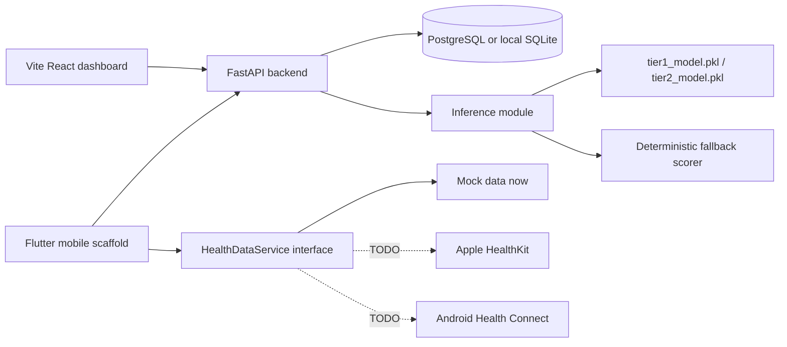

# Architecture

The MVP keeps model inference inside the FastAPI service while preserving a service boundary so it can move out later.

The structure follows the FastAPI full-stack template pattern at a smaller scale: backend service, React web app, database, Docker compose, and documentation. Health integrations follow a modular interface inspired by Health Connect, Flutter `health`, Open Wearables, ResearchKit, and CareKit, but the MVP does not depend on native health APIs.
